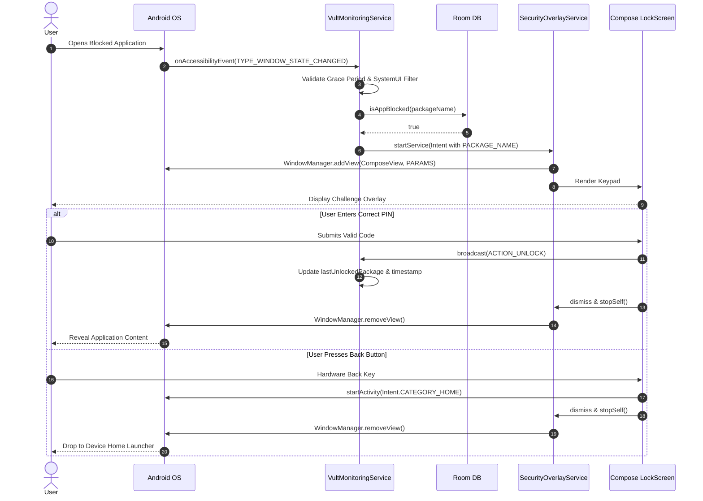
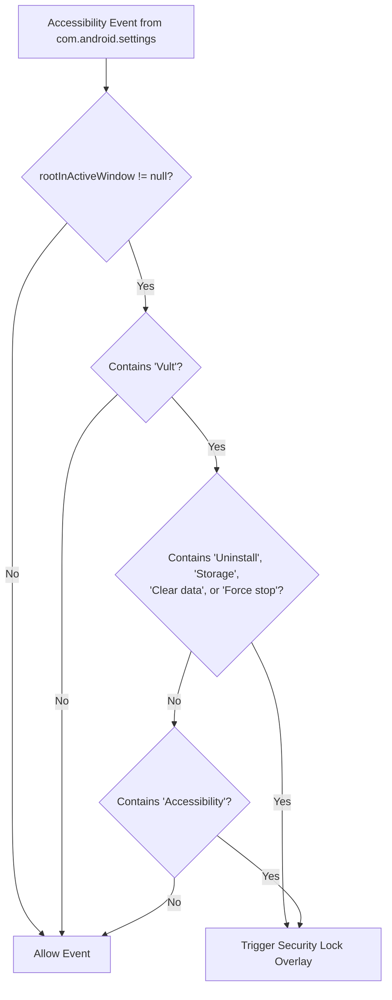
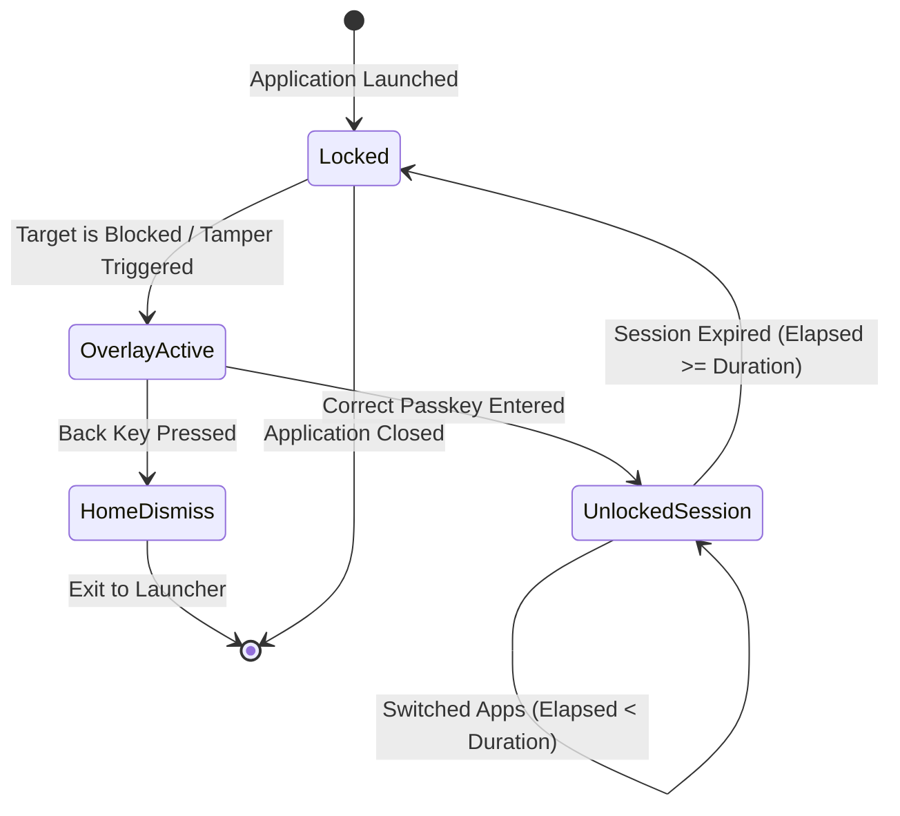

# 🏛️ Vult — Technical Architecture & Internal Design

This document details the software architecture, design patterns, internal subsystems, and security mechanics that power **Vult**. It is written for engineers, contributors, and security auditors who want an in-depth understanding of how Vult enforces app blocking and anti-tamper protections at the Android OS level.

---

## 📑 Table of Contents

- [1. Architectural Principles](#1-architectural-principles)
- [2. High-Level System Architecture](#2-high-level-system-architecture)
- [3. Subsystem Breakdown](#3-subsystem-breakdown)
  - [3.1 System Integration & OS Boundary Layer](#31-system-integration--os-boundary-layer)
  - [3.2 Background Daemon & Monitoring Engine](#32-background-daemon--monitoring-engine)
  - [3.3 WindowManager Compose Host Layer](#33-windowmanager-compose-host-layer)
  - [3.4 Data Access & Persistence Layer](#34-data-access--persistence-layer)
  - [3.5 Presentation & Reactive UI Layer](#35-presentation--reactive-ui-layer)
- [4. Execution & Event Flow](#4-execution--event-flow)
- [5. Anti-Tamper Heuristics Engine](#5-anti-tamper-heuristics-engine)
- [6. Threading & Concurrency Model](#6-threading--concurrency-model)
- [7. Threat Model & Security Mitigations](#7-threat-model--security-mitigations)
- [8. State Machine & Session Lifecycle](#8-state-machine--session-lifecycle)

---

## 1. Architectural Principles

Vult is engineered under five foundational design pillars:

1. **Fail-Closed Security:** If an error, database timeout, or unhandled exception occurs while inspecting a target app, Vult defaults to locking rather than exposing the blocked application.
2. **Deterministic Latency (<50ms):** Interception must happen before the target application can draw its first frame or process input gestures.
3. **Pure On-Device Sovereignty:** Zero cloud dependencies, zero external network requests, zero telemetry. All block lists, preferences, and state are isolated to local storage.
4. **Unidirectional Data Flow (UDF):** The UI layer observes reactive Kotlin `StateFlow` streams and emits intent events back to repositories.
5. **Decoupled Service Lifecycle:** System event detection is separated from overlay rendering to prevent visual crashes from affecting monitoring daemons.

---

## 2. High-Level System Architecture

```mermaid
flowchart TB
    subgraph Android_OS ["Android Operating System Framework"]
        ACC_SYS["Accessibility Service Subsystem"]
        WIN_MGR["WindowManager Service (WMS)"]
        DEV_POL["DevicePolicyManager (DPM)"]
        PKG_MGR["PackageManager API"]
    end

    subgraph Service_Engine ["Core Engine (Background Services)"]
        VMS["VultMonitoringService<br/><i>Daemon observing window events</i>"]
        SOS["SecurityOverlayService<br/><i>System Window overlay coordinator</i>"]
        VAR["VultAdminReceiver<br/><i>Device Admin policy broadcast receiver</i>"]
    end

    subgraph Storage_Layer ["Data & Persistence Layer (Room + DataStore)"]
        APP_DB[("AppDatabase (SQLite / Room)")]
        DAO["BlockedAppDao"]
        PREF["SecurityDataStore (DataStore Preferences)"]
        REPO["AppRepository"]
    end

    subgraph UI_Layer ["Presentation Layer (Jetpack Compose M3)"]
        DASH_VM["DashboardViewModel"]
        DASH_VIEW["DashboardScreen (Apps List & Search)"]
        SETT_VIEW["SettingsScreen (Permissions & Timing)"]
        LOCK_VIEW["SecurityLockScreen (Keypad & Key Interceptor)"]
    end

    %% OS to Services
    ACC_SYS ==>|AccessibilityEvent Stream| VMS
    WIN_MGR <==>|TYPE_APPLICATION_OVERLAY| SOS
    DEV_POL <-->|Admin Policy Queries| VAR
    PKG_MGR -->|Installed Apps Query| REPO

    %% Services to Data
    VMS -->|Check isBlocked(pkg)| DAO
    VMS -->|Read unlockDuration| PREF
    REPO -->|CRUD BlockedApp| DAO
    REPO <--> APP_DB
    APP_DB --- DAO

    %% Services to Presentation
    VMS ==>|Start Intent with Package Details| SOS
    SOS ---|Host ComposeView| LOCK_VIEW
    LOCK_VIEW ==>|ACTION_UNLOCK Broadcast| VMS

    %% UI to ViewModel/Data
    DASH_VM <-->|StateFlow<List<AppInfo>>| REPO
    DASH_VIEW <-->|Collect As State| DASH_VM
    SETT_VIEW <-->|Mutate Duration & Verify Permissions| PREF
```

---

## 3. Subsystem Breakdown

### 3.1 System Integration & OS Boundary Layer

Vult hooks directly into low-level Android frameworks:

* **`AccessibilityService` Subsystem:** Configured in `accessibility_service_config.xml` to listen for:
  * `AccessibilityEvent.TYPE_WINDOW_STATE_CHANGED`: Triggers when an Activity shifts into foreground focus.
  * `AccessibilityEvent.TYPE_WINDOWS_CHANGED`: Triggers on multi-window and split-screen changes.
  * `AccessibilityEvent.TYPE_WINDOW_CONTENT_CHANGED`: Enables real-time node tree inspection inside system settings.
* **`DevicePolicyManager`:** Declared via `device_admin_info.xml` to gain device administrator privileges, prohibiting uninstallation without administrative de-provisioning.
* **`WindowManager` (`TYPE_APPLICATION_OVERLAY`):** Grants permission to create hardware-accelerated windows that sit above normal application task stacks.

---

### 3.2 Background Daemon & Monitoring Engine

The `VultMonitoringService` coordinates the detection logic:

```kotlin
// Simplified architecture trace from VultMonitoringService.kt
override fun onAccessibilityEvent(event: AccessibilityEvent) {
    val packageName = event.packageName?.toString() ?: return
    if (packageName == "com.android.systemui") return

    // 1. Session Grace Period Evaluation
    if (packageName == lastUnlockedPackage && 
       (System.currentTimeMillis() - lastUnlockTime) < dynamicUnlockDuration) {
        return
    }

    // 2. Anti-Tamper Engine
    if (isAntiTamperTriggered(packageName)) {
        launchOverlay(this.packageName, "Vult Security (Tamper Protected)")
        return
    }

    // 3. Database Evaluation
    serviceScope.launch {
        if (database.blockedAppDao().isAppBlocked(packageName)) {
            launchOverlay(packageName)
        }
    }
}
```

* **Session Token Cache:** Maintains `lastUnlockedPackage` and `lastUnlockTime` in memory. This eliminates database I/O for applications that have already been validated within their active grace period.
* **Non-Exported Broadcast Receiver:** Uses `Context.RECEIVER_NOT_EXPORTED` on API 33+ for the `com.ayan.vult.ACTION_UNLOCK` broadcast, securing the unlock signal against inter-process spoofing.

---

### 3.3 WindowManager Compose Host Layer

Hosting Jetpack Compose inside an Android `Service` is traditionally constrained because `ComposeView` expects a live `Activity` lifecycle. Vult solves this by transforming `SecurityOverlayService` into a full lifecycle host:

```
┌─────────────────────────────────────────────────────────────┐
│                 SecurityOverlayService                      │
│                                                             │
│  implements LifecycleOwner                                  │
│  implements ViewModelStoreOwner                             │
│  implements SavedStateRegistryOwner                         │
│                                                             │
│  ┌───────────────────────────────────────────────────────┐  │
│  │                    ComposeView                        │  │
│  │                                                       │  │
│  │   setViewTreeLifecycleOwner(this)                     │  │
│  │   setViewTreeViewModelStoreOwner(this)                │  │
│  │   setViewTreeSavedStateRegistryOwner(this)            │  │
│  │                                                       │  │
│  │   setContent {                                        │  │
│  │       VultTheme {                                     │  │
│  │           SecurityLockScreen(...)                     │  │
│  │       }                                               │  │
│  │   }                                                   │  │
│  └───────────────────────────────────────────────────────┘  │
└─────────────────────────────────────────────────────────────┘
```

#### Window Parameter Configuration:
```kotlin
val params = WindowManager.LayoutParams(
    WindowManager.LayoutParams.MATCH_PARENT,
    WindowManager.LayoutParams.MATCH_PARENT,
    WindowManager.LayoutParams.TYPE_APPLICATION_OVERLAY,
    WindowManager.LayoutParams.FLAG_LAYOUT_IN_SCREEN or
    WindowManager.LayoutParams.FLAG_LAYOUT_NO_LIMITS or
    WindowManager.LayoutParams.FLAG_WATCH_OUTSIDE_TOUCH,
    PixelFormat.TRANSLUCENT
).apply {
    gravity = Gravity.CENTER
    flags = flags and WindowManager.LayoutParams.FLAG_NOT_FOCUSABLE.inv()
}
```

#### Back-Key Trap Implementation:
To prevent users from navigating "back" into the blocked activity beneath the overlay, the lock screen surface consumes the key event and dispatches an intent to Android's home launcher:

```kotlin
.onKeyEvent { event ->
    if (event.key == Key.Back) {
        val homeIntent = Intent(Intent.ACTION_MAIN).apply {
            addCategory(Intent.CATEGORY_HOME)
            flags = Intent.FLAG_ACTIVITY_NEW_TASK
        }
        context.startActivity(homeIntent)
        removeOverlay()
        stopSelf()
        true
    } else {
        false
    }
}
```

---

### 3.4 Data Access & Persistence Layer

* **Room ORM (`AppDatabase`):**
  * Database schema contains a single, high-performance table: `blocked_apps`.
  * Entity: `BlockedApp(packageName: String [PK], appName: String, isBlocked: Boolean)`.
  * DAO query: `SELECT EXISTS(SELECT 1 FROM blocked_apps WHERE packageName = :packageName AND isBlocked = 1)` — executed asynchronously as a suspend function.
* **Jetpack DataStore (`SecurityDataStore`):**
  * Key-value persistence for `unlock_duration` using Proto/Preferences DataStore.
  * Emits changes via Kotlin `Flow<Long>` so services update without application restarts.

---

### 3.5 Presentation & Reactive UI Layer

* **Modern Material 3 Architecture:** Built entirely in Jetpack Compose, using `Scaffold`, `LazyColumn`, and `LargeTopAppBar` with dynamic scroll behaviors.
* **Decoupled MVVM Pattern:** `DashboardViewModel` loads installed applications via `AppRepository`, maps their blocked status against the database, and exposes a unified `StateFlow<List<AppInfo>>`.
* **Asynchronous Image Loading:** Uses `coil-compose` with caching to load and display system application icons smoothly.

---

## 4. Execution & Event Flow



---

## 5. Anti-Tamper Heuristics Engine

Vult detects evasion attempts inside system settings using recursive node-tree inspection:



### Recursive DFS Implementation:
```kotlin
private fun findNodeByText(node: AccessibilityNodeInfo, text: String): Boolean {
    if (node.text?.toString()?.contains(text, ignoreCase = true) == true) return true
    if (node.contentDescription?.toString()?.contains(text, ignoreCase = true) == true) return true

    for (i in 0 until node.childCount) {
        val child = node.getChild(i) ?: continue
        if (findNodeByText(child, text)) return true
    }
    return false
}
```

---

## 6. Threading & Concurrency Model

Vult enforces strict thread separation to maintain UI responsiveness and prevent dropped window frames:

| Context / Thread | Component | Responsibility |
| :--- | :--- | :--- |
| **`Dispatchers.Main`** | `SecurityOverlayService`, Compose UI | Window layout calculations, frame rendering, keypad animations, key event reception. |
| **`Dispatchers.IO`** | `VultMonitoringService.serviceScope` | Room database queries, DataStore disk operations, PackageManager queries. |
| **Android IPC Binder Thread** | `AccessibilityService`, `DeviceAdminReceiver` | System accessibility callbacks and admin policy events. |

---

## 7. Threat Model & Security Mitigations

| Threat / Attack Vector | Mitigation Strategy | Architectural Layer |
| :--- | :--- | :--- |
| **Back Button Evasion** | Catches `Key.Back` event and invokes `Intent.CATEGORY_HOME`. Blocked app is never exposed. | `SecurityOverlayService` |
| **Recent Apps / Split-Screen Evasion** | Listens to `TYPE_WINDOWS_CHANGED` and `TYPE_WINDOW_STATE_CHANGED`. The overlay draws immediately on window focus switch. | `VultMonitoringService` |
| **Settings Force-Stop / Storage Clear** | Recursive `AccessibilityNodeInfo` tree scan identifies settings actions targeted at Vult and triggers lock screen. | `VultMonitoringService` (Heuristics) |
| **Device Admin Removal** | Registered as Device Administrator; uninstallation button is blocked by the OS framework. | `VultAdminReceiver` |
| **Broadcast Spoofing** | Unlock receiver registered with `RECEIVER_NOT_EXPORTED` on API 33+ and locked to app package ID. | `VultMonitoringService` |
| **Database Injection** | Room uses parameterized SQLite queries with compile-time type safety via KSP. | `BlockedAppDao` |

---

## 8. State Machine & Session Lifecycle



---

<div align="center">
<sub>Vult Architecture Document • Built for Android 15 & 16 • MIT Licensed</sub>
</div>
