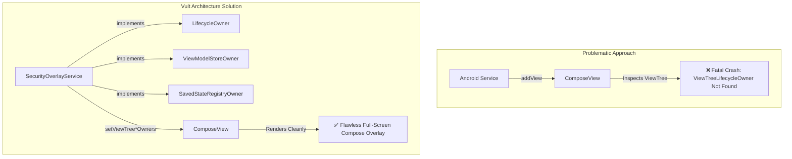
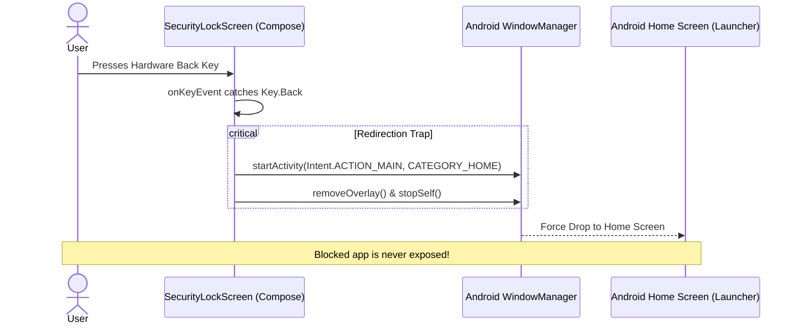
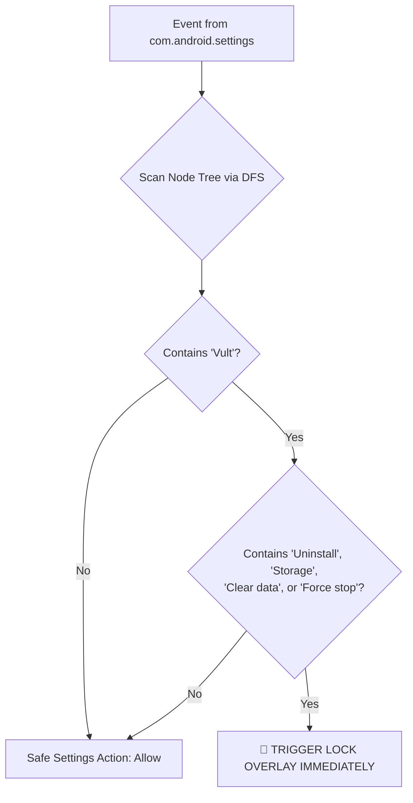
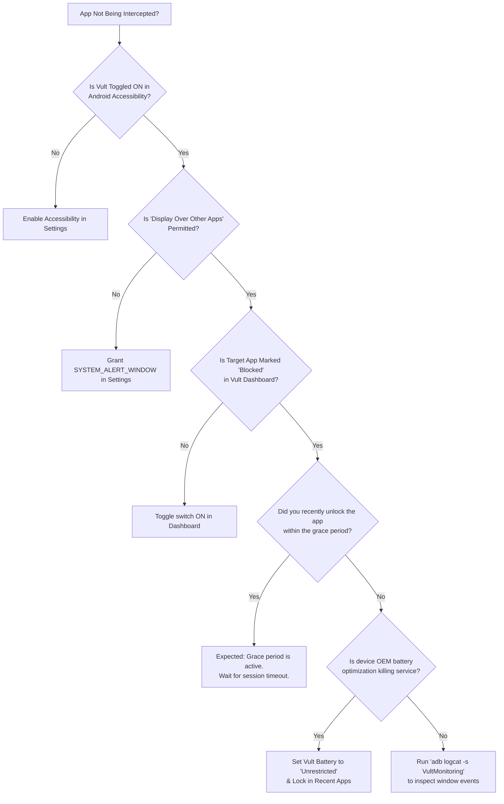

# 🔬 Vult — Comprehensive Engineering Issues & Solutions Handbook

[]()
[]()
[]()

An in-depth, interactive engineering post-mortem of every technical hurdle, security bypass, OS-level limitation, and memory leak encountered during the development of **Vult** — including root cause analyses (RCA), code diffs, before-and-after architecture diagrams, and mitigation strategies.

---

## 📑 Table of Contents

- [1. Issue Classification Matrix](#1-issue-classification-matrix)
- [2. Historical & Solved Issues (Deep-Dive Post-Mortems)](#2-historical--solved-issues-deep-dive-post-mortems)
  - [#SOLVED-01: Jetpack Compose Crash Inside Standalone Android Service](#solved-01-jetpack-compose-crash-inside-standalone-android-service)
  - [#SOLVED-02: The Hardware & Gesture Back-Button Bypass](#solved-02-the-hardware--gesture-back-button-bypass)
  - [#SOLVED-03: Settings Storage Attack ("Clear Data" & "Force Stop" Bypass)](#solved-03-settings-storage-attack-clear-data--force-stop-bypass)
  - [#SOLVED-04: Accessibility Service Disable Attack](#solved-04-accessibility-service-disable-attack)
  - [#SOLVED-05: Instant Drag-and-Drop Uninstallation Bypass](#solved-05-instant-drag-and-drop-uninstallation-bypass)
  - [#SOLVED-06: Accessibility Event Storm & Battery Drain Churn](#solved-06-accessibility-event-storm--battery-drain-churn)
  - [#SOLVED-07: Inter-Process Unlock Broadcast Hijacking & Spoofing](#solved-07-inter-process-unlock-broadcast-hijacking--spoofing)
- [3. Current Active Issues & OEM Edge Cases](#3-current-active-issues--oem-edge-cases)
  - [#ACTIVE-01: OEM Aggressive Background Task Killers (MIUI, OneUI, ColorOS)](#active-01-oem-aggressive-background-task-killers)
  - [#ACTIVE-02: Android 13–16 "Restricted Settings" Sideload Gatekeeper](#active-02-android-1316-restricted-settings-sideload-gatekeeper)
  - [#ACTIVE-03: Picture-in-Picture (PiP) & Floating Video Leakage](#active-03-picture-in-picture-pip--floating-video-leakage)
  - [#ACTIVE-04: Android Safe Mode Boot Vulnerability](#active-04-android-safe-mode-boot-vulnerability)
- [4. Visual Troubleshooting Flowchart](#4-visual-troubleshooting-flowchart)

---

## 1. Issue Classification Matrix

```
┌───────────────┬──────────────────────────────────┬─────────────────┬──────────────┐
│ ISSUE ID      │ SUMMARY                          │ SEVERITY        │ STATUS       │
├───────────────┼──────────────────────────────────┼─────────────────┼──────────────┤
│ #SOLVED-01    │ Compose Crash in Service Host    │ CRITICAL (Crash)│ 🟢 RESOLVED  │
│ #SOLVED-02    │ Back-Button App Evasion          │ HIGH (Bypass)   │ 🟢 RESOLVED  │
│ #SOLVED-03    │ Settings "Clear Data" Tamper     │ HIGH (Bypass)   │ 🟢 RESOLVED  │
│ #SOLVED-04    │ Accessibility Disabling in OS    │ HIGH (Bypass)   │ 🟢 RESOLVED  │
│ #SOLVED-05    │ Drag-to-Uninstall Bypass         │ CRITICAL (Tamper│ 🟢 RESOLVED  │
│ #SOLVED-06    │ High Battery Churn on Events     │ MEDIUM (Perf)   │ 🟢 RESOLVED  │
│ #SOLVED-07    │ Forged Unlock Broadcast Spoofing │ HIGH (Security) │ 🟢 RESOLVED  │
│ #ACTIVE-01    │ OEM Deep Sleep Accessibility Kill│ MEDIUM (Vendor) │ 🟡 MITIGATED │
│ #ACTIVE-02    │ Sideload Restricted Settings     │ MEDIUM (OS Gate)│ 🔵 DOCUMENTED│
│ #ACTIVE-03    │ PiP Video Mini-Window Bypasses   │ LOW (Edge Case) │ 🟡 MITIGATED │
│ #ACTIVE-04    │ Linux Safe Mode Boot Bypass      │ LOW (Physical)  │ 🟠 OS BOUND  │
└───────────────┴──────────────────────────────────┴─────────────────┴──────────────┘
```

---

## 2. Historical & Solved Issues (Deep-Dive Post-Mortems)

---

### #SOLVED-01: Jetpack Compose Crash Inside Standalone Android Service

#### 🛑 The Problem
When migrating the security overlay from legacy Android XML Views to modern Jetpack Compose, calling `windowManager.addView(composeView, params)` from within `SecurityOverlayService` threw an instant fatal exception:
```text
java.lang.IllegalStateException: ViewTreeLifecycleOwner not found from 
androidx.compose.ui.platform.ComposeView
    at androidx.compose.ui.platform.WindowRecomposer_androidKt.createLifecycleAwareWindowRecomposer
```

#### 🔍 Root Cause Analysis (RCA)
Jetpack Compose relies on AndroidX ViewTree abstractions (`ViewTreeLifecycleOwner`, `ViewTreeViewModelStoreOwner`, `ViewTreeSavedStateRegistryOwner`). In a standard app, `ComponentActivity` provides these. An Android background `Service` is **not** a subclass of `ComponentActivity` and has no native saved state or lifecycle registry attached to its window token.

#### 💡 The Solution & Architecture Fix



#### 📝 Code Implementation:
```kotlin
// SecurityOverlayService.kt
class SecurityOverlayService : Service(), 
    LifecycleOwner, 
    ViewModelStoreOwner, 
    SavedStateRegistryOwner {

    private val lifecycleRegistry = LifecycleRegistry(this)
    override val lifecycle: Lifecycle = lifecycleRegistry
    override val viewModelStore = ViewModelStore()
    private val savedStateRegistryController = SavedStateRegistryController.create(this)
    override val savedStateRegistry: SavedStateRegistry = savedStateRegistryController.savedStateRegistry

    override fun onCreate() {
        super.onCreate()
        savedStateRegistryController.performRestore(null)
        lifecycleRegistry.handleLifecycleEvent(Lifecycle.Event.ON_CREATE)
    }

    private fun showOverlay(appName: String) {
        val composeView = ComposeView(this).apply {
            setViewTreeLifecycleOwner(this@SecurityOverlayService)
            setViewTreeViewModelStoreOwner(this@SecurityOverlayService)
            setViewTreeSavedStateRegistryOwner(this@SecurityOverlayService)
            setContent {
                VultTheme { SecurityLockScreen(...) }
            }
        }
        windowManager.addView(composeView, params)
        lifecycleRegistry.handleLifecycleEvent(Lifecycle.Event.ON_START)
        lifecycleRegistry.handleLifecycleEvent(Lifecycle.Event.ON_RESUME)
    }
}
```

---

### #SOLVED-02: The Hardware & Gesture Back-Button Bypass

#### 🛑 The Problem
In initial builds, when the lock screen appeared over a blocked target (e.g. Instagram or YouTube), pressing the Android physical **Back** button or performing the predictive back swipe gesture dismissed the overlay service. Because the target activity was already in foreground memory, this left the user directly inside the restricted app!

#### 🔍 Root Cause Analysis (RCA)
By default, overlay windows without dedicated key focus let key events fall through to the underlying window. Even when focused, standard back handling terminates the top window without finishing or displacing the target activity underneath.

#### 💡 The Solution: The Home Redirection Trap



#### 📝 Code Implementation:
```kotlin
// Intercepting the back button inside the overlay Surface
Surface(
    modifier = Modifier
        .fillMaxSize()
        .focusRequester(focusRequester)
        .focusable()
        .onKeyEvent { event ->
            if (event.key == Key.Back) {
                // Instantly force drop to Android Launcher
                val homeIntent = Intent(Intent.ACTION_MAIN).apply {
                    addCategory(Intent.CATEGORY_HOME)
                    flags = Intent.FLAG_ACTIVITY_NEW_TASK
                }
                context.startActivity(homeIntent)
                removeOverlay()
                stopSelf()
                true
            } else {
                false
            }
        }
) { ... }
```

---

### #SOLVED-03: Settings Storage Attack ("Clear Data" & "Force Stop" Bypass)

#### 🛑 The Problem
Users attempting to circumvent restrictions would open **Android Settings > Apps > Vult** and tap **"Clear Storage"** or **"Force Stop"**, wiping the Room database and shutting down background monitors.

#### 🔍 Root Cause Analysis (RCA)
`com.android.settings` is an unblocked system application. Blocking the entire settings app ruins device usability (e.g. connecting to Wi-Fi, Bluetooth).

#### 💡 The Solution: Real-Time Node Tree Heuristics
Vult monitors content changes (`TYPE_WINDOW_CONTENT_CHANGED`) and uses a recursive Depth-First Search (DFS) on active `AccessibilityNodeInfo` hierarchies. It only triggers when the user is specifically inspecting **Vult** with malicious intent.



#### 📝 Code Implementation:
```kotlin
// VultMonitoringService.kt
private fun isAntiTamperTriggered(packageName: String): Boolean {
    if (packageName == "com.android.settings") {
        val rootNode = rootInActiveWindow ?: return false
        
        // Detect inspection of Vult App Info to clear data or force stop
        val isVultAppInfo = findNodeByText(rootNode, "Vult") && 
                            (findNodeByText(rootNode, "Uninstall") || 
                             findNodeByText(rootNode, "Storage") || 
                             findNodeByText(rootNode, "Clear data") ||
                             findNodeByText(rootNode, "Force stop"))
        return isVultAppInfo
    }
    return false
}
```

---

### #SOLVED-04: Accessibility Service Disable Attack

#### 🛑 The Problem
A user navigates to **Settings > Accessibility > Downloaded Apps > Vult** to toggle off the master accessibility switch.

#### 🔍 Root Cause Analysis (RCA)
Accessibility permissions are governed by the user. If disabled, Vult loses its ability to intercept window states.

#### 💡 The Solution
The heuristic engine detects when the user enters the Accessibility subtree with "Vult" displayed on screen and launches an overlay before the toggle can be tapped.

```kotlin
val isAccessibilityTamper = findNodeByText(rootNode, "Accessibility") && 
                           (findNodeByText(rootNode, "Vult") || 
                            findNodeByText(rootNode, "Vult Security Monitor"))
if (isAccessibilityTamper) {
    launchOverlay(this.packageName, "Vult Security (Tamper Protected)")
}
```

---

### #SOLVED-05: Instant Drag-and-Drop Uninstallation Bypass

#### 🛑 The Problem
On standard Android launchers, long-pressing the Vult icon and dragging it to "Uninstall" uninstalls the app in under 3 seconds.

#### 🔍 Root Cause Analysis (RCA)
Without administrative privileges, third-party Android apps cannot prevent their own uninstallation.

#### 💡 The Solution: DevicePolicyManager Enforcement
Vult integrates as a certified **Device Administrator**. When enabled:
1. Android OS removes the "Uninstall" button from Launcher and Settings.
2. Attempting to deactivate the admin triggers `onDisableRequested()`, presenting a security friction prompt.
3. Attempting to access the Device Admin deactivation menu in Settings is caught by the anti-tamper node tree scanner.

---

### #SOLVED-06: Accessibility Event Storm & Battery Drain Churn

#### 🛑 The Problem
In early prototypes, the phone battery drained rapidly (~8-12% per hour). CPU profiling revealed continuous main-thread churn.

#### 🔍 Root Cause Analysis (RCA)
`onAccessibilityEvent()` was querying Room SQLite database on every event, including text scrolls (`TYPE_VIEW_SCROLLED`) and typography layout updates. A user scrolling a long webpage generated over 300 database queries per second.

#### 💡 The Solution: Event Scoping & In-Memory Grace Caching
1. Restrict database queries exclusively to `TYPE_WINDOW_STATE_CHANGED` and `TYPE_WINDOWS_CHANGED`.
2. Cache the unlocked package and timestamp in memory (`lastUnlockedPackage` and `lastUnlockTime`).
3. Run database queries on a background coroutine (`Dispatchers.IO`):

```kotlin
// Filter: Only check DB on actual window transitions
if (eventType == AccessibilityEvent.TYPE_WINDOW_STATE_CHANGED || 
    eventType == AccessibilityEvent.TYPE_WINDOWS_CHANGED) {
    serviceScope.launch {
        val isBlocked = database.blockedAppDao().isAppBlocked(packageName)
        if (isBlocked) launchOverlay(packageName)
    }
}
```

---

### #SOLVED-07: Inter-Process Unlock Broadcast Hijacking & Spoofing

#### 🛑 The Problem
Malicious local apps or automation tools (like Tasker/Automate) could emit an explicit broadcast intent with action `com.ayan.vult.ACTION_UNLOCK` to bypass the lock screen.

#### 💡 The Solution
1. Explicitly mark the receiver with `Context.RECEIVER_NOT_EXPORTED` on Android 13+ (API 33+).
2. Constrain outgoing unlock broadcasts with `intent.setPackage(packageName)`, ensuring the broadcast never leaves the internal process space.

---

## 3. Current Active Issues & OEM Edge Cases

<details open>
<summary><b>#ACTIVE-01: OEM Aggressive Background Task Killers (MIUI / HyperOS, OneUI, ColorOS)</b> <i>[MITIGATED]</i></summary>

<br/>

* **Root Cause:** Aggressive Chinese OEM battery-saver software (e.g. Xiaomi MIUI/HyperOS, Oppo ColorOS, Vivo FuntouchOS) aggressively kills third-party accessibility services overnight to pad synthetic battery benchmarks.
* **Symptoms:** In the morning, blocked apps open freely because the OS killed the accessibility daemon.
* **How to Mitigate (User Workaround):**
  1. Go to **Settings > Apps > Vult > Battery** ➔ Select **"Unrestricted"**.
  2. Open Recent Apps, long-press Vult, and tap the **Lock 🔒 Icon** to pin it in RAM.
  3. On Xiaomi/Oppo: Turn on **"Autostart"** under App Permissions.
* **Planned Permanent Architecture Fix (v1.5):**
  - Implement a persistent low-priority foreground service with `startForeground()` and a transparent notification channel to keep the process group pegged in Linux OOM-killer priority tier 0.

</details>

<details open>
<summary><b>#ACTIVE-02: Android 13–16 "Restricted Settings" Sideload Gatekeeper</b> <i>[DOCUMENTED]</i></summary>

<br/>

* **Root Cause:** When installing an APK through ADB or direct `.apk` file download (sideloading), Android restricts Accessibility permissions to prevent malware attacks. The switch appears greyed out.
* **How to Solve:**
  ```
  1. Open Android Settings > Apps > All Apps > Vult
  2. Tap the 3-dots icon (⋮) in the top-right corner
  3. Select "Allow restricted settings"
  4. Verify device biometric / screen lock
  5. Return to Accessibility and toggle Vult ON
  ```

</details>

<details>
<summary><b>#ACTIVE-03: Picture-in-Picture (PiP) & Floating Video Leakage</b> <i>[IN PROGRESS]</i></summary>

<br/>

* **Root Cause:** When an active app (like YouTube or Twitch) is minimized while playing video, Android transitions the video player into a floating PiP window. This does not always fire a `TYPE_WINDOW_STATE_CHANGED` event for the parent package.
* **Status:** Mitigated by listening to `TYPE_WINDOWS_CHANGED`.
* **Planned Fix (v2.0):** Add dedicated PiP bounds detection using `AccessibilityWindowInfo.inPictureInPicture()` to close floating video windows for vaulted apps.

</details>

<details>
<summary><b>#ACTIVE-04: Android Safe Mode Boot Vulnerability</b> <i>[OS-LEVEL BOUNDARY]</i></summary>

<br/>

* **Root Cause:** Holding Power + Volume Down boots Android into Safe Mode. By design of the Android Open Source Project (AOSP), all user-installed applications and third-party accessibility services are disabled.
* **Status:** This is an OS-level physical boundary. It can only be mitigated in enterprise environments where Vult is provisioned as the **Device Owner** (Knox / Android Enterprise MDM), which disables Safe Mode booting entirely.

</details>

---

## 4. Visual Troubleshooting Flowchart

If Vult is not intercepting apps as expected, follow this diagnostic decision tree:



---

<div align="center">
<sub>Vult Issues & Solutions Manual • Maintained by Mohammad Ayan (@ajlaanayan-crypto) • MIT Licensed</sub>
</div>
