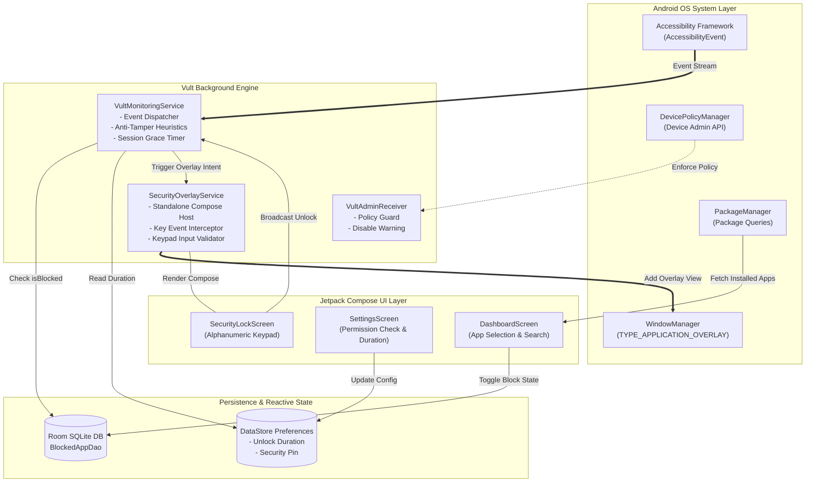
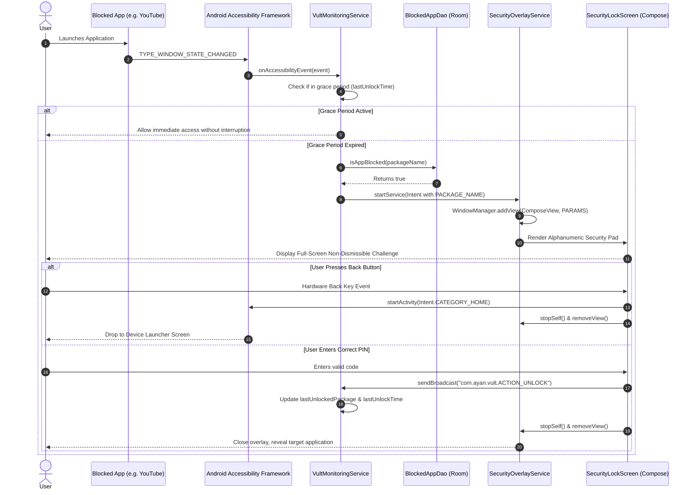

<div align="center">

#  V U L T
### *The Zero-Compromise, Tamper-Proof Android Application Vault*

[](https://opensource.org/licenses/MIT)
[](https://kotlinlang.org)
[](https://developer.android.com)
[](https://developer.android.com/jetpack/compose)
[]()
[]()

<br/>

> **"Most app blockers ask for your permission to stop you. Vult enforces it."**  
> *Engineered to eliminate bypass shortcuts, prevent hasty uninstallations, and provide impenetrable digital discipline through deep Android OS kernel and accessibility subsystem integration.*

<br/>

[Key Features](#-key-features) • [Why Vult?](#-why-vult-the-anti-bypass-philosophy) • [Comparison Matrix](#-how-vult-compares) • [Architecture](ARCHITECTURE.md) • [Design System](DESIGN.md) • [Issues Solved](#-engineering-challenges--solved-issues) • [Local Testing Guide](#-comprehensive-local-testing-guide) • [Roadmap](#-future-roadmap)

---

</div>

<br/>

## 📖 Table of Contents

- [🌟 Key Features](#-key-features)
- [🧠 Why Vult? The Anti-Bypass Philosophy](#-why-vult-the-anti-bypass-philosophy)
- [📊 How Vult Compares (Comparison Matrix)](#-how-vult-compares)
- [🔄 System Architecture & How It Works](#-system-architecture--how-it-works)
  - [High-Level Component Interaction](#high-level-component-interaction)
  - [Interception & Lock Sequence Diagram](#interception--lock-sequence-diagram)
- [🧩 Deep-Dive Codebase Breakdown](#-deep-dive-codebase-breakdown)
  - [1. Accessibility Monitoring Service (`VultMonitoringService`)](#1-accessibility-monitoring-service-vultmonitoringservice)
  - [2. Standalone Compose Overlay (`SecurityOverlayService`)](#2-standalone-compose-overlay-securityoverlayservice)
  - [3. Device Policy Administration (`VultAdminReceiver`)](#3-device-policy-administration-vultadminreceiver)
  - [4. Local Storage & Session State (`AppDatabase` & `SecurityDataStore`)](#4-local-storage--session-state-appdatabase--securitydatastore)
- [🛠️ Engineering Challenges & Solved Issues](#-engineering-challenges--solved-issues)
- [⚠️ Known Current Edge Cases & Workarounds](#️-known-current-edge-cases--workarounds)
- [🧪 Comprehensive Local Testing Guide](#-comprehensive-local-testing-guide)
  - [Automated ADB Setup (One-Click)](#1-automated-adb-permission-injection)
  - [Exhaustive QA Test Matrix (8 Tests)](#2-exhaustive-qa-test-matrix)
- [🗺️ Future Roadmap & Upcoming Updates](#️-future-roadmap--upcoming-updates)
- [🔒 Permissions Deep-Dive](#-permissions-deep-dive)
- [🤝 Contributing & Community](#-contributing--community)
- [📜 License & Author](#-license--author)

---

## 🌟 Key Features

<div align="center">

```
 ┌──────────────────────┐   ┌──────────────────────┐   ┌──────────────────────┐
 │  ⚡ <50ms Intercept   │   │  🛑 Hardware Home    │   │  🛡️ Anti-Settings    │
 │  Accessibility Hook  │   │  Back-Key Redirection│   │  Tree Inspection     │
 └──────────────────────┘   └──────────────────────┘   └──────────────────────┘
 ┌──────────────────────┐   ┌──────────────────────┐   ┌──────────────────────┐
 │  👮 Device Admin     │   │  ⏱️ Dynamic Grace    │   │  📴 100% Offline     │
 │  Uninstall Guard     │   │  Session Memory      │   │  No Telemetry/APIs   │
 └──────────────────────┘   └──────────────────────┘   └──────────────────────┘
```

</div>

* **⚡ Ultra-Low Latency Interception (<50ms):** Continuous accessibility window event listening hooks into package launches before application frames can finish rendering.
* **🛑 Hardware Back-Key Capture & Redirection:** Intercepts physical and gestural `Back` events using custom key event handlers that launch `Intent.CATEGORY_HOME`, sending impulsive users back to the Android launcher rather than letting them slip into the blocked app.
* **🛡️ Real-Time Anti-Settings Heuristics:** Evaluates `AccessibilityNodeInfo` hierarchies inside `com.android.settings`. If a user navigates to Vult to trigger *"Clear Storage"*, *"Force Stop"*, or disable the Accessibility service, Vult instantly launches its security lockscreen on top of the Settings window.
* **👮 Device Administrator Anti-Uninstall Shield:** Registers as an active Device Administrator (`DevicePolicyManager`) to prevent casual or impulsive drag-to-uninstall actions.
* **⏱️ Configurable Dynamic Grace Sessions:** Choose between *Always Lock*, *1 Minute*, *5 Minutes*, *15 Minutes*, *30 Minutes*, or *1 Hour* temporary unlock windows, persisted reactively through Jetpack DataStore.
* **🎨 Edge-to-Edge Material 3 UI:** Fluid animations, modern typography, reactive app toggles with asynchronous icon rasterization via Coil Compose.
* **📴 Absolute Data Privacy:** Operates with zero network permissions, zero analytics SDKs, zero crash reporters, and zero trackers. Your usage history never leaves your device memory.

---

## 🧠 Why Vult? The Anti-Bypass Philosophy

### The Inherent Flaw in Traditional Screen-Time Apps
Most popular digital well-being apps operate on a passive model:
1. **Passive Notifications:** They alert you that "Time is up", which can be dismissed with a single swipe.
2. **Activity-Level Locks:** Standard app lockers launch a standard `Activity`. Users quickly learn to bypass them by spamming the **Recent Apps** switcher, opening split-screen view, or simply opening **Android Settings > Apps > Force Stop**.
3. **Instant Uninstall Vulnerability:** When resistance triggers, users uninstall the app in under 4 seconds from their home screen launcher.

### The Vult Solution: Intentional Friction
Vult is built on the philosophy of **hard enforced friction**:
* It does not negotiate with dopamine surges.
* It wraps the window manager directly at the OS level (`TYPE_APPLICATION_OVERLAY`), rendering above apps, popups, and dialogs.
* It prevents users from accessing settings pages where Vult could be neutered.
* It requires a dedicated, deliberate code entry challenge to open restricted apps.

---

## 📊 How Vult Compares

| Feature / Capability | Vult | Android Digital Wellbeing | Standard AppLockers | Opal / Freedom (Android) |
| :--- | :---: | :---: | :---: | :---: |
| **Tamper Protection (Settings)** | 🟢 **Active Tree Scan** | 🔴 None | 🔴 None | 🟡 VPN Only |
| **Uninstall Deterrence** | 🟢 **Device Admin** | 🔴 Easily Disabled | 🔴 None | 🟡 VPN Profile |
| **Hardware Back Interception** | 🟢 **Home Redirect** | 🔴 Pass-through | 🟡 Closes App | 🔴 Varies |
| **Real-time Latency** | 🟢 **< 50ms** | 🟡 500ms - 2s | 🟡 ~200ms | 🟡 Periodic Poll |
| **Privacy & Cloud Reliance** | 🟢 **100% Offline** | 🟡 Google Account | 🔴 Ad Networks / Analytics | 🔴 Cloud Subscription |
| **Overlay Technology** | 🟢 **Compose in WindowManager** | 🔴 System Dialog | 🔴 Legacy View Activity | 🟡 Local VPN Mock |
| **Open Source** | 🟢 **MIT License** | 🔴 Proprietary | 🔴 Closed Source | 🔴 Proprietary |

---

## 🔄 System Architecture & How It Works

### High-Level Component Interaction



### Interception & Lock Sequence Diagram



---

## 🧩 Deep-Dive Codebase Breakdown

<details>
<summary><b>1. Accessibility Monitoring Service (<code>VultMonitoringService.kt</code>)</b> — <i>Click to expand</i></summary>

```kotlin
// Listens to window changes, performs live inspection, and manages unlock sessions
override fun onAccessibilityEvent(event: AccessibilityEvent) {
    val eventType = event.eventType
    if (eventType == AccessibilityEvent.TYPE_WINDOW_STATE_CHANGED || 
        eventType == AccessibilityEvent.TYPE_WINDOWS_CHANGED ||
        eventType == AccessibilityEvent.TYPE_WINDOW_CONTENT_CHANGED) {
        
        val packageName = event.packageName?.toString() ?: return
        if (packageName == "com.android.systemui") return

        // Session grace period check
        if (packageName == lastUnlockedPackage && 
           (System.currentTimeMillis() - lastUnlockTime) < dynamicUnlockDuration) {
            return
        }

        // Anti-Tamper detection in Settings
        if (isAntiTamperTriggered(packageName)) {
            launchOverlay(this.packageName, "Vult Security (Tamper Protected)")
            return
        }

        // Check local database for blocked state
        serviceScope.launch {
            if (database.blockedAppDao().isAppBlocked(packageName)) {
                if (Settings.canDrawOverlays(this@VultMonitoringService)) {
                    launchOverlay(packageName)
                }
            }
        }
    }
}
```

* **Core Responsibility:** Serves as the central nervous system.
* **Supervised Concurrency:** Runs queries under `SupervisorJob() + Dispatchers.IO` so unexpected DB timeouts never crash the service.
* **Protected Broadcast Receiver:** Uses `Context.RECEIVER_NOT_EXPORTED` on API 33+ ensuring external malware cannot forge unlock broadcast signals.

</details>

<details>
<summary><b>2. Standalone Compose Overlay (<code>SecurityOverlayService.kt</code>)</b> — <i>Click to expand</i></summary>

Hosting Jetpack Compose inside a `android.app.Service` without an Activity is historically difficult because Compose requires lifecycle, saved state, and viewmodel owners. `SecurityOverlayService` implements all three directly:

```kotlin
class SecurityOverlayService : Service(), 
    LifecycleOwner, 
    ViewModelStoreOwner, 
    SavedStateRegistryOwner {

    // ViewTree owners injected into ComposeView
    val composeView = ComposeView(this).apply {
        setViewTreeLifecycleOwner(this@SecurityOverlayService)
        setViewTreeViewModelStoreOwner(this@SecurityOverlayService)
        setViewTreeSavedStateRegistryOwner(this@SecurityOverlayService)
        setContent {
            VultTheme {
                SecurityLockScreen(...)
            }
        }
    }
    windowManager.addView(composeView, params)
}
```

* **Hardware Key Handling:** Captures `Key.Back` directly via `.onKeyEvent { ... }` on the compose modifier, redirecting to `Intent.CATEGORY_HOME`.
* **Window Parameters:** Uses `FLAG_LAYOUT_IN_SCREEN`, `FLAG_LAYOUT_NO_LIMITS`, and `FLAG_WATCH_OUTSIDE_TOUCH` with pixel format `PixelFormat.TRANSLUCENT` to prevent view tearing.

</details>

<details>
<summary><b>3. Device Policy Administration (<code>VultAdminReceiver.kt</code>)</b> — <i>Click to expand</i></summary>

```kotlin
class VultAdminReceiver : DeviceAdminReceiver() {
    override fun onDisableRequested(context: Context, intent: Intent): CharSequence {
        return "Disabling Vult Device Admin will reduce the security of your device."
    }
}
```

* Registered in `AndroidManifest.xml` with `android.permission.BIND_DEVICE_ADMIN`.
* Linked to `@xml/device_admin_info` requesting policies that raise warning friction when removal is attempted.

</details>

<details>
<summary><b>4. Local Storage & Session State (<code>AppDatabase.kt</code> & <code>SecurityDataStore.kt</code>)</b> — <i>Click to expand</i></summary>

* **Room Database:** Stores `BlockedApp` table with fast primary key lookup on `packageName`.
* **DataStore Preferences:** Reactive key `UNLOCK_DURATION` provides live updates across coroutines whenever changed in Settings.

</details>

---

## 🛠️ Engineering Challenges & Solved Issues

During the development and testing of Vult, several technical hurdles inherent to Android OS constraints were identified and solved:

```
┌──────────────────────────────────────────────┬──────────────────────────────────────────────┐
│ CHALLENGE / PROBLEM                          │ ARCHITECTURAL SOLUTION                       │
├──────────────────────────────────────────────┼──────────────────────────────────────────────┤
│ 1. Compose Crash in Android Service          │ Implemented LifecycleOwner, SavedStateOwner, │
│    Compose views expect an Activity context  │ & ViewModelStoreOwner in Service directly.   │
├──────────────────────────────────────────────┼──────────────────────────────────────────────┤
│ 2. Back Button Bypass                        │ Intercepted KeyEvent.Key.Back in Compose     │
│    Users pressed back to sneak into app      │ and dispatched Intent(ACTION_MAIN, HOME).    │
├──────────────────────────────────────────────┼──────────────────────────────────────────────┤
│ 3. Settings Clear-Data Bypass                │ Real-time AccessibilityNodeInfo heuristic    │
│    Users clicked "Clear Storage" in Settings │ tree scan on com.android.settings.           │
├──────────────────────────────────────────────┼──────────────────────────────────────────────┤
│ 4. Service Toggle Disabling                  │ Blocked node paths mentioning "Vult" inside  │
│    Users toggled Accessibility off           │ Accessibility settings screen.               │
├──────────────────────────────────────────────┼──────────────────────────────────────────────┤
│ 5. CPU Churn from Event Floods               │ Filtered out non-window events and cached    │
│    Accessibility emits hundreds of events/s  │ unlock state in in-memory memory primitives. │
├──────────────────────────────────────────────┼──────────────────────────────────────────────┤
│ 6. Unauthorized Intent Exploits              │ Bound unlock broadcast receiver to           │
│    Third-party apps forging unlock signals   │ Context.RECEIVER_NOT_EXPORTED.               │
└──────────────────────────────────────────────┴──────────────────────────────────────────────┘
```

---

## ⚠️ Known Current Edge Cases & Workarounds

While Vult provides high tamper-resistance, Android's OEM diversity creates unique edge cases:

<details>
<summary><b>1. OEM Aggressive Battery Killers (MIUI / HyperOS, ColorOS, OneUI)</b></summary>

* **Problem:** Manufacturers frequently kill background accessibility services after prolonged screen-off time.
* **Workaround:** In your device's settings:
  1. Set Vult battery usage to **"Unrestricted"**.
  2. In Recent Apps, tap the lock icon on Vult to keep it pinned in memory.
  3. Turn on **"Autostart"** (specifically on Xiaomi/Poco/Oppo devices).
</details>

<details>
<summary><b>2. Android 13/14/15/16 "Restricted Setting" on Sideloaded APKs</b></summary>

* **Problem:** When installing via APK rather than Google Play, Android may grey out Accessibility with *"Restricted setting"*.
* **Workaround:**
  1. Open Android **Settings > Apps > Vult**.
  2. Tap the **Three Dots (⋮)** in the top-right corner.
  3. Tap **"Allow restricted settings"**.
  4. Authenticate with device fingerprint/PIN, then return to Accessibility to enable Vult.
</details>

<details>
<summary><b>3. Safe Mode Boot</b></summary>

* **Limitation:** Booting an Android device into Safe Mode disables all 3rd-party accessibility services and user-installed apps by design of the Linux kernel.
* **Status:** This is an OS-level physical vulnerability that cannot be overridden without root/MDM-enrolled Knox or Android Enterprise Owner permissions.

</details>

---

## 🧪 Comprehensive Local Testing Guide

Follow this definitive testing manual to test and verify every module of Vult on your local machine using Android Studio and ADB.

### 1. Automated ADB Permission Injection
Instead of manually navigating through multiple Android settings pages, run these ADB commands from your terminal to configure everything instantly:

```bash
# 1. Enable System Alert Window (Display over other apps)
adb shell appops set com.ayan.vult SYSTEM_ALERT_WINDOW allow

# 2. Enable Accessibility Monitoring Service
adb shell settings put secure enabled_accessibility_services com.ayan.vult/com.ayan.vult.service.VultMonitoringService
adb shell settings put secure accessibility_enabled 1

# 3. Activate Device Administrator
adb shell dpm set-device-admin com.ayan.vult/.receiver.VultAdminReceiver

# 4. Stream real-time Vult logcat logs
adb logcat -s VultMonitoring SecurityOverlay VultAdmin
```

---

### 2. Exhaustive QA Test Matrix

Run through this 8-step test checklist to confirm 100% test integrity:

```
[TEST 1] Interception Verification
 ├─ Step 1: Open Vult Dashboard.
 ├─ Step 2: Toggle ON block for "Google Chrome" or "YouTube".
 ├─ Step 3: Switch to Home Screen and tap the blocked app icon.
 └─ EXPECTED: Within 50ms, Vult's dark security keypad appears. Target app content is hidden.

[TEST 2] Alphanumeric Code Verification
 ├─ Step 1: Enter an incorrect 9-digit code (e.g. 111111111).
 ├─ Step 2: Observe red error prompt: "Incorrect Code".
 ├─ Step 3: Enter the configured PIN code.
 └─ EXPECTED: Overlay immediately dismisses, unlocking the application.

[TEST 3] Hardware Back-Key Evasion Prevention
 ├─ Step 1: Launch a blocked app to trigger the overlay.
 ├─ Step 2: Press the physical Back button or perform the back swipe gesture.
 └─ EXPECTED: You are instantly redirected to the Android Home Screen. The app is never exposed.

[TEST 4] Grace Period Expiry Verification
 ├─ Step 1: In Vult Settings, set Unlock Duration to "1 Minute".
 ├─ Step 2: Unlock a blocked app. Switch between apps within 60 seconds (no lock screen).
 ├─ Step 3: Wait 61 seconds and launch the blocked app again.
 └─ EXPECTED: Lock screen immediately prompts again for authentication.

[TEST 5] Anti-Tamper: Clear Data Attack Test
 ├─ Step 1: Open Android Settings > Apps > See all apps > Vult.
 ├─ Step 2: Tap on "Storage & cache".
 └─ EXPECTED: Vult node inspector triggers; Security Lock Screen pops up over Settings.

[TEST 6] Anti-Tamper: Accessibility Disable Test
 ├─ Step 1: Open Android Settings > Accessibility.
 ├─ Step 2: Attempt to tap on "Vult" to disable the service.
 └─ EXPECTED: Overlay immediately intercepts the action and demands authorization.

[TEST 7] Device Admin Uninstall Prevention
 ├─ Step 1: Go to device launcher, long-press Vult app icon, tap "App Info" or drag to "Uninstall".
 ├─ Step 2: Observe system prompt.
 └─ EXPECTED: Uninstall button is greyed out or displays an error stating app is a Device Administrator.

[TEST 8] Device Reboot & Service Recovery
 ├─ Step 1: Reboot your Android phone/emulator: `adb reboot`.
 ├─ Step 2: Once booted, launch a blocked app immediately without opening Vult first.
 └─ EXPECTED: Vult automatically intercepts the app without requiring manual launch.
```

---

## 🗺️ Future Roadmap & Upcoming Updates

<div align="center">

```
  2026 Q3               2026 Q4               2027 Q1               2027 Q2
┌─────────────┐       ┌─────────────┐       ┌─────────────┐       ┌─────────────┐
│ 🛡️ v1.0     │  ───> │ 🧬 v1.5     │  ───> │ ⏰ v2.0     │  ───> │ 🤝 v2.5     │
│ Core Engine │       │ Biometrics  │       │ Schedules & │       │ Partner PIN │
│ Admin Guard │       │ Custom PIN  │       │ Pomodoro    │       │ Geofencing  │
└─────────────┘       └─────────────┘       └─────────────┘       └─────────────┘
```

</div>

- [x] **v1.0 (Current Release):**
  - [x] Real-time accessibility monitoring engine (`<50ms`).
  - [x] Jetpack Compose in `WindowManager` overlay.
  - [x] Device Administrator anti-uninstall integration.
  - [x] Settings tree heuristic tamper detection.
  - [x] Configurable dynamic grace durations.
- [ ] **v1.5 (In Progress):**
  - [ ] **Biometric Hardware Authentication:** BiometricPrompt fallback with encrypted keystore.
  - [ ] **Custom Dynamic PINs:** User-defined PIN with PBKDF2 cryptographic hashing.
  - [ ] **Adaptive App Icon Packs:** Seamless custom theming with dynamic Material You tokens.
- [ ] **v2.0 (Planned):**
  - [ ] **Scheduled Lock Windows:** Automatic vaults during sleep or study hours.
  - [ ] **Pomodoro Focus Timer:** 25/5 strict interval enforcement.
  - [ ] **Strict Mode / Lockout Challenge:** Option to disable unlock completely for X hours.
- [ ] **v2.5 (Future Horizon):**
  - [ ] **Accountability Partner System:** Requires a 2nd device to approve unlock requests.
  - [ ] **Geofencing Locks:** Automatically restrict social apps upon arriving at the workplace or library.

---

## 🔒 Permissions Deep-Dive

```
android.permission.BIND_ACCESSIBILITY_SERVICE
  ├── Classification: Special Protected Access
  └── Role: Continuously evaluates window transitions to detect target launches.

android.permission.SYSTEM_ALERT_WINDOW
  ├── Classification: Display Over Other Apps
  └── Role: Allocates hardware overlay buffers above active third-party activities.

android.permission.BIND_DEVICE_ADMIN
  ├── Classification: Device Administration Framework
  └── Role: Enforces anti-removal rules by declaring system administrator privileges.

android.permission.QUERY_ALL_PACKAGES
  ├── Classification: Broad Package Visibility
  └── Role: Populates the user dashboard with all installed applications on Android 11+.

android.permission.PACKAGE_USAGE_STATS
  ├── Classification: App Usage Telemetry
  └── Role: Supplementary diagnostics for verifying foreground activity state.
```

---

## 💻 Tech Stack Overview

* **Programming Language:** [Kotlin 2.0.20](https://kotlinlang.org/)
* **UI Toolkit:** [Jetpack Compose (BOM 2024.09.00)](https://developer.android.com/jetpack/compose) with Material 3
* **Dependency Injection & Async:** Kotlin Coroutines 1.8+, Flow, StateFlow, AndroidX ViewModel
* **Local Persistence:** AndroidX Room Database 2.6+ with KSP code generator
* **Reactive Preferences:** Jetpack DataStore Preferences
* **Image Loading:** Coil Compose 2.7.0
* **Build System:** Gradle Kotlin DSL (`build.gradle.kts`) with Version Catalogs (`libs.versions.toml`)

---

## 🤝 Contributing & Community

Contributions are welcomed! Whether it's adding features, fixing edge-case OEM bugs, or improving documentation:

1. **Fork the Repository**
2. **Create a Feature Branch:** `git checkout -b feature/amazing-feature`
3. **Commit Your Changes:** `git commit -m 'feat: Add biometric unlock support'`
4. **Push to Branch:** `git push origin feature/amazing-feature`
5. **Open a Pull Request**

---

## 👤 Author

**Mohammad Ayan**
* **GitHub:** [@ajlaanayan-crypto](https://github.com/ajlaanayan-crypto)
* **Email:** [ajlaan.ayan@gmail.com](mailto:ajlaan.ayan@gmail.com)
* **Website:** [ajlaan.netlify.app](https://ajlaan.netlify.app)

---

## 📄 License

Distributed under the **MIT License**. See [LICENSE](LICENSE) for more information.

<div align="center">
<sub>Built with determination for digital focus and human freedom.</sub>
</div>
