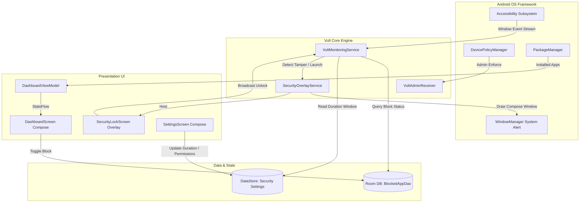
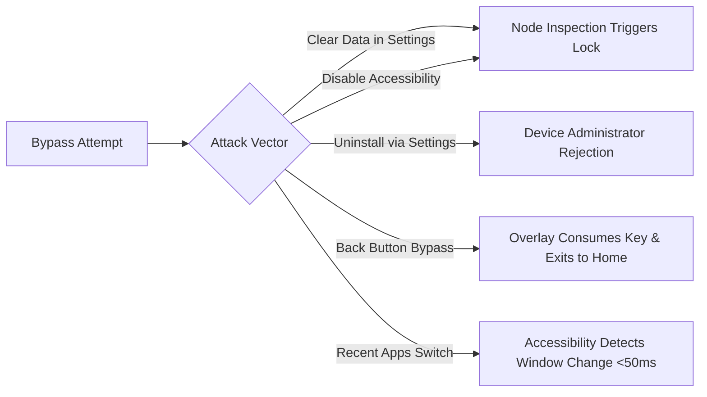

# 🛡️ Vult — High-Security Android App Blocker & Vault

[](https://opensource.org/licenses/MIT)
[](https://kotlinlang.org)
[-3DDC84.svg?logo=android&logoColor=white)](https://developer.android.com)
[](https://developer.android.com)
[-4285F4.svg?logo=jetpackcompose&logoColor=white)](https://developer.android.com/jetpack/compose)
[]()

**Vult** is an enterprise-grade, privacy-first Android application blocker and digital discipline vault. Built using **Kotlin** and **Jetpack Compose (Material 3)**, Vult enforces strict application boundaries through deep Android OS integration, real-time window inspection, system-level security overlays, and aggressive anti-tamper safeguards.

Unlike standard screen-time apps that can be bypassed by simply closing an activity or clearing app storage, Vult integrates the **Device Administrator API** and real-time **Accessibility Service heuristics** to prevent evasion, unauthorized force-stopping, or circumvention.

---

## 📑 Table of Contents

- [Core Features](#-core-features)
- [System Architecture](#-system-architecture)
- [How It Works (Execution Lifecycle)](#-how-it-works-execution-lifecycle)
- [Deep Dive: Core Modules](#-deep-dive-core-modules)
  - [1. Monitoring Service (`VultMonitoringService`)](#1-monitoring-service-vultmonitoringservice)
  - [2. Security Overlay (`SecurityOverlayService`)](#2-security-overlay-securityoverlayservice)
  - [3. Anti-Tamper & Device Admin (`VultAdminReceiver`)](#3-anti-tamper--device-admin-vultadminreceiver)
  - [4. Data & Persistence (`AppDatabase` & `SecurityDataStore`)](#4-data--persistence-appdatabase--securitydatastore)
  - [5. Dashboard & UI Layer (`DashboardScreen`)](#5-dashboard--ui-layer-dashboardscreen)
- [Security Model & Anti-Tamper Heuristics](#-security-model--anti-tamper-heuristics)
- [Permissions Matrix](#-permissions-matrix)
- [Project Directory Structure](#-project-directory-structure)
- [Getting Started](#-getting-started)
  - [Prerequisites](#prerequisites)
  - [Building from Source](#building-from-source)
  - [Initial Setup & Configuration](#initial-setup--configuration)
- [Troubleshooting & FAQs](#-troubleshooting--faqs)
- [Technology Stack](#-technology-stack)
- [Author & License](#-author--license)

---

## ✨ Core Features

| Feature | Description |
| :--- | :--- |
| **⚡ Real-Time App Interception** | Continuous window state monitoring detects launched targets within 50ms and prevents interaction. |
| **🔐 System Overlay Challenge** | Emits a hardware-back-intercepting, full-screen lock screen over any blocked application using `TYPE_APPLICATION_OVERLAY`. |
| **🛡️ Anti-Tamper Engine** | Actively scans Settings and Package Installer node hierarchies to block attempts to "Force Stop", "Clear Data", or toggle off accessibility. |
| **👮 Device Administrator Guard** | Registers as an active Device Administrator (`DevicePolicyManager`) to stop uninstallation attempts in their tracks. |
| **⏱️ Dynamic Unlock Sessions** | Configurable grace periods: *Always Lock*, *1 Minute*, *5 Minutes*, *15 Minutes*, *30 Minutes*, or *1 Hour*. |
| **🎨 Material 3 Adaptive UI** | Responsive dark/light console styled with modern Material Design 3 guidelines and edge-to-edge support. |
| **🔒 100% Offline & Private** | Zero analytics, zero cloud tracking, zero network telemetry. All rules and block states reside in local Room & DataStore instances. |

---

## 🏗️ System Architecture

Vult operates on an event-driven architecture that bridges Android OS system services with a reactive Jetpack Compose presentation layer:



---

## 🔄 How It Works (Execution Lifecycle)

1. **Window Transition:** When a user opens any app on the device, the Android Accessibility framework broadcasts an `AccessibilityEvent.TYPE_WINDOW_STATE_CHANGED` event.
2. **Package Interception:** `VultMonitoringService` captures the target package name:
   - **System UI Check:** Ignores `com.android.systemui` to preserve status and navigation bar operation.
   - **Grace Period Check:** Checks if the package was recently unlocked and if `currentTime - lastUnlockTime < dynamicUnlockDuration`.
   - **Anti-Tamper Scan:** If the package is `com.android.settings` or `packageinstaller`, the node tree is inspected for keywords like `"Uninstall"`, `"Clear data"`, or `"Vult"`.
   - **Blocklist Check:** Queries `BlockedAppDao.isAppBlocked(packageName)`.
3. **Overlay Presentation:** If blocked or if tampering is detected, an intent is dispatched to `SecurityOverlayService`.
4. **Hardware Key Interception:** The lock screen consumes input and listens for `Key.Back`. Pressing back automatically sends the user to the device's home screen (`CATEGORY_HOME`), ensuring the blocked app is never exposed.
5. **Code Verification:** Upon entering the correct passkey, a local broadcast (`com.ayan.vult.ACTION_UNLOCK`) resets the grace timer and dismisses the overlay.

---

## 🔍 Deep Dive: Core Modules

### 1. Monitoring Service (`VultMonitoringService`)
Located at `app/src/main/java/com/ayan/vult/service/VultMonitoringService.kt`
- Extends `android.accessibilityservice.AccessibilityService`.
- Configured with `TYPE_WINDOW_STATE_CHANGED`, `TYPE_WINDOWS_CHANGED`, and `TYPE_WINDOW_CONTENT_CHANGED`.
- Uses a background coroutine scope (`SupervisorJob() + Dispatchers.IO`) for non-blocking database queries.
- Dynamically receives unlock events via a non-exported broadcast receiver (`Context.RECEIVER_NOT_EXPORTED`).

### 2. Security Overlay (`SecurityOverlayService`)
Located at `app/src/main/java/com/ayan/vult/service/SecurityOverlayService.kt`
- Implements `LifecycleOwner`, `ViewModelStoreOwner`, and `SavedStateRegistryOwner` directly within a background `Service` to host AndroidX `ComposeView` windows outside an Activity.
- Parameters configured:
  ```kotlin
  WindowManager.LayoutParams.TYPE_APPLICATION_OVERLAY
  WindowManager.LayoutParams.FLAG_LAYOUT_IN_SCREEN
  WindowManager.LayoutParams.FLAG_LAYOUT_NO_LIMITS
  WindowManager.LayoutParams.FLAG_WATCH_OUTSIDE_TOUCH
  ```
- Renders `SecurityLockScreen` containing an alphanumeric keypad, PIN state indicators, and error animations.

### 3. Anti-Tamper & Device Admin (`VultAdminReceiver`)
Located at `app/src/main/java/com/ayan/vult/receiver/VultAdminReceiver.kt`
- Subclasses `DeviceAdminReceiver` registered with `android.permission.BIND_DEVICE_ADMIN`.
- Overrides `onDisableRequested` to provide warning prompts when revocation is attempted.
- Integrates with system policy checks in `SettingsScreen` to inform the user of security status.

### 4. Data & Persistence (`AppDatabase` & `SecurityDataStore`)
Located at `app/src/main/java/com/ayan/vult/data/`
- **Room Database (`AppDatabase`):** Persists `BlockedApp` records (`packageName`, `appName`, `isBlocked`). Exposes reactive Kotlin `Flow<List<BlockedApp>>` streams.
- **DataStore Preferences (`SecurityDataStore`):** Manages `unlock_duration` and PIN challenge validation.

### 5. Dashboard & UI Layer (`DashboardScreen`)
Located at `app/src/main/java/com/ayan/vult/ui/dashboard/`
- Built completely in Jetpack Compose Material 3.
- Reads device packages through `PackageManager.getInstalledApplications()`, filtering out internal system frameworks.
- Loads high-resolution app icons asynchronously using `coil-compose`.
- Offers instant, reactive search filtering across app names and package identifiers.

---

## 🛡️ Security Model & Anti-Tamper Heuristics

Traditional app lockers are notoriously fragile against simple workarounds. Vult incorporates multi-layered mitigations:



1. **Accessibility Setting Defense:** When a user accesses Android Settings, Vult inspects the active `AccessibilityNodeInfo` tree. If the user navigates into Accessibility Services to toggle off Vult, the lock screen immediately triggers over the settings window.
2. **App Info / Clear Cache Defense:** If the user opens Vult's app details in Settings with intent to "Force Stop" or "Clear Data", the security overlay intercepts the action immediately.
3. **Uninstall Deterrence:** With Device Admin enabled, the OS prevents standard uninstallation through package managers until the admin permission is explicitly revoked (which is itself protected by accessibility interception).

---

## 📋 Permissions Matrix

| Permission | Android API Level | Purpose |
| :--- | :--- | :--- |
| `BIND_ACCESSIBILITY_SERVICE` | All Supported | Real-time foreground app and window state observation. |
| `SYSTEM_ALERT_WINDOW` | All Supported | Displaying the system-level lock screen overlay. |
| `BIND_DEVICE_ADMIN` | All Supported | Deterring unauthorized app uninstallation and tampering. |
| `PACKAGE_USAGE_STATS` | API 21+ | Diagnostics and secondary verification of foreground apps. |
| `QUERY_ALL_PACKAGES` | API 30+ | Enumerating installed third-party apps for blocklist selection. |
| `REQUEST_DELETE_PACKAGES` | API 26+ | Management and clean uninstallation handling when authorized. |

---

## 📁 Project Directory Structure

```text
Vult/
├── app/
│   ├── src/
│   │   ├── main/
│   │   │   ├── AndroidManifest.xml              # Manifest, permissions, receivers & services
│   │   │   ├── java/com/ayan/vult/
│   │   │   │   ├── MainActivity.kt              # App entry point & compose host
│   │   │   │   ├── data/                        # Persistence layer
│   │   │   │   │   ├── AppDatabase.kt           # Room DB instance
│   │   │   │   │   ├── AppInfo.kt               # Domain model for installed apps
│   │   │   │   │   ├── AppRepository.kt         # Data repository & package manager bridge
│   │   │   │   │   ├── BlockedApp.kt            # Room Entity
│   │   │   │   │   ├── BlockedAppDao.kt         # Room Data Access Object
│   │   │   │   │   └── SecurityDataStore.kt     # Jetpack DataStore preferences
│   │   │   │   ├── navigation/
│   │   │   │   │   └── NavKey.kt                # Type-safe Navigation 3 routes
│   │   │   │   ├── receiver/
│   │   │   │   │   └── VultAdminReceiver.kt     # Device Administrator API handler
│   │   │   │   ├── service/
│   │   │   │   │   ├── SecurityOverlayService.kt # System window overlay & compose keypad
│   │   │   │   │   └── VultMonitoringService.kt  # Accessibility service & anti-tamper logic
│   │   │   │   └── ui/
│   │   │   │       ├── dashboard/               # Main vault dashboard & viewmodel
│   │   │   │       ├── settings/                # Security settings & permission status
│   │   │   │       └── theme/                   # Material 3 color palettes & typography
│   │   │   └── res/                             # Icons, XML configs, drawables, strings
│   │   │       ├── xml/accessibility_service_config.xml
│   │   │       └── xml/device_admin_info.xml
│   │   └── test/                                # Unit tests
│   └── build.gradle.kts                         # App module Gradle configuration
├── gradle/
│   └── libs.versions.toml                       # Centralized Version Catalog
├── build.gradle.kts                             # Root build configuration
├── settings.gradle.kts                          # Gradle project settings
├── LICENSE                                      # MIT License
└── README.md                                    # Project documentation
```

---

## 🚀 Getting Started

### Prerequisites
- **Android Studio:** Android Studio Ladybug (2024.2+) or newer
- **Java Development Kit:** JDK 17 or JDK 21
- **Android Device / Emulator:** Running Android 15 (API level 35) or Android 16 (API level 37)

### Building from Source

1. **Clone the repository:**
   ```bash
   git clone https://github.com/ajlaanayan-crypto/Vult.git
   cd Vult
   ```

2. **Verify Gradle Wrapper:**
   ```bash
   ./gradlew --version
   ```

3. **Assemble Debug APK:**
   ```bash
   ./gradlew assembleDebug
   ```
   The resulting APK will be generated at `app/build/outputs/apk/debug/app-debug.apk`.

4. **Install to Connected Device via ADB:**
   ```bash
   adb install -r app/build/outputs/apk/debug/app-debug.apk
   ```

### Initial Setup & Configuration

Once installed on a device:
1. Launch **Vult**.
2. Navigate to **Settings** from the top bar.
3. Enable each required permission:
   - **Accessibility Service:** Tap the card, locate **Vult** under Downloaded Services, and toggle it **ON**.
   - **System Overlay:** Tap the card and enable **Allow display over other apps**.
   - **Device Administrator:** Tap the card and select **Activate this device admin app**.
4. Return to the **Dashboard** and toggle the lock switch on any app you wish to vault.

---

## 🛠️ Troubleshooting & FAQs

#### Q: The overlay does not appear when opening a blocked app.
- **Check Overlay Permission:** Confirm that "Display over other apps" is allowed in Android Settings > Apps > Special app access > Display over other apps > Vult.
- **Check Accessibility:** Some manufacturers (e.g., Xiaomi, Samsung, OnePlus) kill background accessibility services to save battery. In system settings, turn off **Battery Optimization** for Vult and grant it permission to run unrestricted in the background.

#### Q: How does the unlock grace period work?
- Once you successfully unlock an app, Vult grants an unlock window (default: 1 minute, customizable in Settings). During this window, you can freely switch tasks without entering the code repeatedly. After the duration expires, subsequent launches will require re-verification.

#### Q: How do I completely uninstall Vult?
- Because Vult registers as a **Device Administrator**, you must first deactivate it:
  1. Open **Vult > Settings**.
  2. Tap **Device Administrator** and deactivate the policy.
  3. Turn off the **Accessibility Service**.
  4. Proceed with normal uninstallation from Android Settings or Google Play.

---

## 💻 Technology Stack

- **Language:** [Kotlin 2.0+](https://kotlinlang.org/)
- **UI Toolkit:** [Jetpack Compose](https://developer.android.com/jetpack/compose) with [Material Design 3](https://m3.material.io/)
- **Architecture Components:**
  - `androidx.lifecycle:lifecycle-viewmodel-compose`
  - `androidx.navigation3`
  - `androidx.room:room-ktx` (with KSP code generator)
  - `androidx.datastore:datastore-preferences`
- **Asynchronous Execution:** [Kotlin Coroutines](https://github.com/Kotlin/kotlinx.coroutines) & StateFlow
- **Image Loading:** [Coil Compose](https://coil-kt.github.io/coil/compose/)

---

## 👤 Author

**Mohammad Ayan**
- GitHub: [@ajlaanayan-crypto](https://github.com/ajlaanayan-crypto)
- Email: [ajlaan.ayan@gmail.com](mailto:ajlaan.ayan@gmail.com)

---

## 📄 License

This project is licensed under the **MIT License** — see the [LICENSE](LICENSE) file for details.
