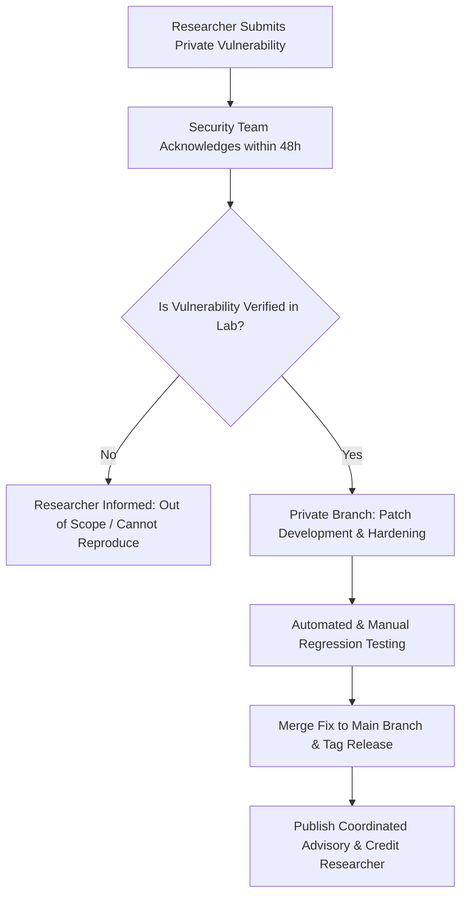

# 🔒 Vult — Security Policy & Threat Model

[]()
[]()
[]()
[]()

Security, tamper resistance, and user privacy form the bedrock of **Vult**. Because Vult operates as an enforcement vault at the Android OS layer, we treat security vulnerabilities, bypass vectors, and privilege leaks with highest priority.

---

## 📑 Table of Contents

- [1. Supported Versions](#1-supported-versions)
- [2. Threat Model & Trust Boundaries](#2-threat-model--trust-boundaries)
  - [In-Scope Threats (Protected)](#in-scope-threats-protected)
  - [Out-of-Scope Threats (OS Limitations)](#out-of-scope-threats-os-limitations)
- [3. Vulnerability Reporting Process (Responsible Disclosure)](#3-vulnerability-reporting-process-responsible-disclosure)
- [4. Vulnerability Lifecycle Flowchart](#4-vulnerability-lifecycle-flowchart)
- [5. Cryptographic & IPC Security Standards](#5-cryptographic--ipc-security-standards)
- [6. Anti-Tamper Heuristic Auditing](#6-anti-tamper-heuristic-auditing)
- [7. Security Hall of Fame](#7-security-hall-of-fame)

---

## 1. Supported Versions

We provide security updates and patches for the following versions of Vult:

| Version | Supported | Minimum Android OS | Target Android OS | Notes |
| :--- | :---: | :--- | :--- | :--- |
| **`v1.0.x` (Current)** | 🟢 **Active** | Android 15 (API 35) | Android 16 / 15 (API 37) | Full security & anti-tamper patching |
| `< v1.0.0` (Development) | 🔴 **End of Life** | N/A | N/A | Prototype builds, unsupported |

---

## 2. Threat Model & Trust Boundaries

To accurately evaluate reported issues, our threat model is categorized into strictly defined security zones:

```
┌─────────────────────────────────────────────────────────────────────────┐
│                           TRUST BOUNDARIES                              │
├───────────────────────────────────┬─────────────────────────────────────┤
│ 🛡️ IN-SCOPE (Vult Protects)       │ ⚠️ OUT-OF-SCOPE (Kernel/Hardware)   │
├───────────────────────────────────┼─────────────────────────────────────┤
│ • Opportunistic app launches      │ • Bootloader-level attacks (Fastboot│
│ • Impulsive task switching        │ • Magisk / KernelSU root hooks      │
│ • Hardware Back key bypass        │ • Android Linux Safe Mode boot      │
│ • Settings Force-Stop attacks     │ • Physical display disassembly      │
│ • Settings Storage-Clear attacks  │ • Custom ROM OS-level kernel forks  │
│ • Drag-to-Uninstall bypassing     │ • ADB shell revocation via USB debug│
│ • Local inter-process IPC forgery │ • Physical hardware theft           │
└───────────────────────────────────┴─────────────────────────────────────┘
```

### In-Scope Threats (Protected)
* **Application Evasion:** Rapidly switching between Recent Apps or tapping notifications to sneak into a blocked app without challenge.
* **Settings Manipulation:** Navigating to Android Settings to clear app data, force-stop Vult, or disable its Accessibility Service.
* **Launcher Uninstallation:** Dragging the app icon to "Uninstall" or using package installer prompts.
* **Malicious Local Intent Injection:** Malicious applications installed on the same device broadcasting forged `ACTION_UNLOCK` intents.

### Out-of-Scope Threats (OS Limitations)
* **Root Access (`su` / Magisk / KernelSU):** If a user possesses root access, they can manipulate the Linux process table (`kill -9`) or directly modify `/data/data/com.ayan.vult`. No non-root Android application can defend against a compromised kernel.
* **Safe Mode Reboot:** Booting the phone with hardware keys held down disables all user-installed accessibility services at the bootloader/AOSP level.
* **ADB Command Line Access:** A user with USB Debugging enabled executing `adb uninstall` or `adb shell pm disable` from a workstation is considered an authorized developer override.

---

## 3. Vulnerability Reporting Process (Responsible Disclosure)

If you discover a security bypass, a privilege leak, or a technique to circumvent Vult's overlay without authentication, please follow our **Responsible Disclosure Policy**:

> ⚠️ **DO NOT open public GitHub Issues for unpatched security vulnerabilities.**

### How to Report:
1. **Direct Email:** Send an encrypted or plain email to:
   - **Primary Security Contact:** Mohammad Ayan
   - **Email:** [ajlaan.ayan@gmail.com](mailto:ajlaan.ayan@gmail.com)
   - **Subject Line:** `[SECURITY DISCLOSURE] Vult - <Short Description>`
2. **Include Required Information:**
   - Detailed description of the bypass or vulnerability.
   - Exact reproduction steps (or minimal proof-of-concept APK/script).
   - Test device model, Android version, and manufacturer skin (e.g. Pixel Android 15, Xiaomi HyperOS, Samsung OneUI 6.1).
   - Estimated security impact and potential mitigations.

### Response Time Commitment:
* **Initial Acknowledgment:** Within **24 to 48 hours**.
* **Triage & Reproduce Verification:** Within **5 business days**.
* **Patch Development & Release:** Target within **14 business days** depending on severity.
* **Public Advisory:** Published in coordination with the researcher once the fix is deployed.

---

## 4. Vulnerability Lifecycle Flowchart



---

## 5. Cryptographic & IPC Security Standards

Vult adheres to modern Android enterprise security practices:

### 1. Inter-Process Communication (IPC) Hardening
* All dynamic broadcast receivers are registered with `Context.RECEIVER_NOT_EXPORTED` on API 33+ to reject intent broadcasts from unauthorized external applications.
* Explicit broadcast intents specify `intent.setPackage(context.packageName)` to lock intent routing to Vult's UID.

### 2. Zero-Telemetry & Offline Isolation
* Vult contains **no internet networking code** in its data pipeline (`AppDatabase`, `SecurityDataStore`).
* The `INTERNET` manifest permission is absent from runtime networking dependencies; the app cannot transmit user logs, package blocklists, or unlock codes over the network.

### 3. Surface & Window Security
* The security overlay uses `WindowManager.LayoutParams.FLAG_LAYOUT_IN_SCREEN` and `WindowManager.LayoutParams.TYPE_APPLICATION_OVERLAY`.
* Hardware Back-key handlers consume all system key events, redirecting directly to `Intent.CATEGORY_HOME` so protected content is never exposed in the transition.

---

## 6. Anti-Tamper Heuristic Auditing

When developing or auditing Vult's accessibility heuristics:
* **Node Tree Sanitization:** The recursive node inspector (`findNodeByText`) traverses `AccessibilityNodeInfo` instances carefully and recycles resources to avoid memory leaks.
* **Fail-Closed Principle:** If node inspection is interrupted or times out, the service falls back to displaying the lockscreen overlay on the target window rather than permitting open access.

---

## 7. Security Hall of Fame

We believe in recognizing independent security researchers, reverse engineers, and developers who help make Vult impenetrable. Significant security discoveries will be honored in this section with public credit:

| Contributor / Researcher | Vulnerability Description | Date Resolved | Patch Version |
| :--- | :--- | :--- | :--- |
| *Your Name Here* | *Report a valid bypass vector to be featured* | — | — |

---

<div align="center">
<sub>Maintained with rigorous security standards by Mohammad Ayan (@ajlaanayan-crypto) • MIT Licensed</sub>
</div>
