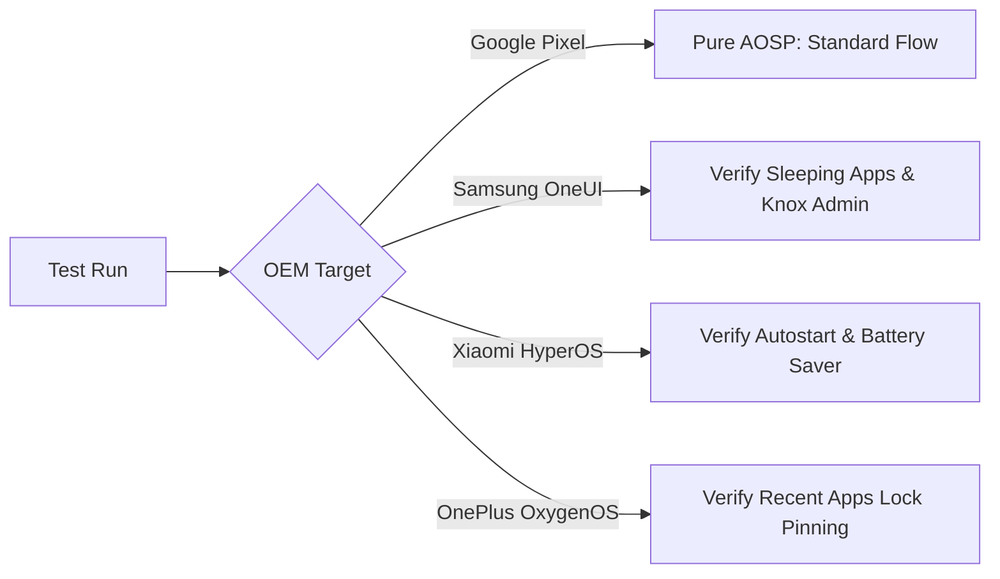

# 🧪 Vult — Testing, Quality Assurance & Verification Manual

[]()
[]()
[]()
[]()

A comprehensive, interactive testing guide and verification manual for **Vult**. This document covers local developer test execution, automated ADB test harnesses, Compose UI instrumentation, Room SQLite unit tests, and monkey stress testing.

---

## 📑 Table of Contents

- [1. Testing Strategy & Pyramid](#1-testing-strategy--pyramid)
- [2. Unit Testing Suite (Local JVM)](#2-unit-testing-suite-local-jvm)
  - [Running Unit Tests via CLI](#running-unit-tests-via-cli)
  - [Testing Room Database (`BlockedAppDao`)](#testing-room-database-blockedappdao)
  - [Testing Dashboard ViewModels with Coroutines](#testing-dashboard-viewmodels-with-coroutines)
- [3. Instrumented UI & Compose Tests (Device / Emulator)](#3-instrumented-ui--compose-tests-device--emulator)
  - [Testing Compose Lockscreen Keypad](#testing-compose-lockscreen-keypad)
- [4. Automated Terminal Test Harness (One-Click Bash Script)](#4-automated-terminal-test-harness-one-click-bash-script)
- [5. Exhaustive QA Verification Matrix (Step-by-Step)](#5-exhaustive-qa-verification-matrix-step-by-step)
- [6. Chaos & Stress Testing (Android UI Monkey)](#6-chaos--stress-testing-android-ui-monkey)
- [7. OEM Compatibility & Edge Case Testing](#7-oem-compatibility--edge-case-testing)
- [8. Continuous Integration (CI) Workflow](#8-continuous-integration-ci-workflow)

---

## 1. Testing Strategy & Pyramid

Vult's test architecture is structured across three verification layers:

```
                  ┌───────────────────────────────┐
                  │      7. Stress / Monkey       │  <-- Chaos & Memory Leaks
                  │      6. Automated ADB         │  <-- End-to-End OS Integration
                  ├───────────────────────────────┤
                  │  5. Compose Instrumented Tests│  <-- Keypad & Window Rendering
                  ├───────────────────────────────┤
                  │     4. Room DAO Tests         │  <-- In-Memory SQLite Queries
                  │     3. ViewModel Unit Tests   │  <-- StateFlow & Coroutines
                  │     2. DataStore Logic Tests  │  <-- Preferences Serialization
                  └───────────────────────────────┘
```

---

## 2. Unit Testing Suite (Local JVM)

Local unit tests run on the host development machine without an emulator, offering sub-second execution times.

### Running Unit Tests via CLI

```bash
# Execute all local unit tests for the debug build variant
./gradlew testDebugUnitTest

# Run tests with detailed stack traces
./gradlew testDebugUnitTest --stacktrace --info
```

### Testing Room Database (`BlockedAppDao`)

We verify block status insertions, queries, and deletions using in-memory Room SQLite instances:

```kotlin
@RunWith(AndroidJUnit4::class)
class BlockedAppDaoTest {
    private lateinit var database: AppDatabase
    private lateinit var dao: BlockedAppDao

    @Before
    fun createDb() {
        val context = ApplicationProvider.getApplicationContext<Context>()
        database = Room.inMemoryDatabaseBuilder(context, AppDatabase::class.java)
            .allowMainThreadQueries()
            .build()
        dao = database.blockedAppDao()
    }

    @After
    fun closeDb() {
        database.close()
    }

    @Test
    fun insertAndVerifyBlockedStatus() = runTest {
        val testApp = BlockedApp("com.example.game", "Example Game", isBlocked = true)
        dao.insert(testApp)

        val isBlocked = dao.isAppBlocked("com.example.game")
        assertTrue(isBlocked)

        val isNonExistentBlocked = dao.isAppBlocked("com.example.unblocked")
        assertFalse(isNonExistentBlocked)
    }
}
```

### Testing Dashboard ViewModels with Coroutines

ViewModels are tested using `kotlinx.coroutines.test.runTest` and a `StandardTestDispatcher`:

```kotlin
@OptIn(ExperimentalCoroutinesApi::class)
class DashboardViewModelTest {
    private val testDispatcher = StandardTestDispatcher()

    @Before
    fun setup() {
        Dispatchers.setMain(testDispatcher)
    }

    @After
    fun tearDown() {
        Dispatchers.resetMain()
    }

    @Test
    fun toggleAppBlock_updatesRepository() = runTest {
        val fakeRepo = FakeAppRepository()
        val viewModel = DashboardViewModel(fakeRepo)

        val testApp = AppInfo("Chrome", "com.android.chrome", isBlocked = false)
        viewModel.toggleAppBlock(testApp)
        testDispatcher.scheduler.advanceUntilIdle()

        assertTrue(fakeRepo.isAppBlocked("com.android.chrome"))
    }
}
```

---

## 3. Instrumented UI & Compose Tests (Device / Emulator)

Instrumented tests run on a live connected device or Android Virtual Device (AVD) running API 35+.

### Running Instrumented Tests via CLI

```bash
./gradlew connectedDebugAndroidTest
```

### Testing Compose Lockscreen Keypad

Using `ComposeContentTestRule` to simulate user taps on the alphanumeric keypad:

```kotlin
@RunWith(AndroidJUnit4::class)
class SecurityLockScreenTest {

    @get:Rule
    val composeTestRule = createComposeRule()

    @Test
    fun testKeypadInput_updatesIndicators() {
        var unlocked = false

        composeTestRule.setContent {
            VultTheme {
                SecurityOverlayService().SecurityLockScreen(
                    appName = "Protected Target",
                    onUnlock = { unlocked = true }
                )
            }
        }

        // Verify title exists
        composeTestRule.onNodeWithText("Vult Locked").assertIsDisplayed()
        composeTestRule.onNodeWithText("Protected Target").assertIsDisplayed()

        // Tap numbers on keypad
        composeTestRule.onNodeWithText("1").performClick()
        composeTestRule.onNodeWithText("2").performClick()
        composeTestRule.onNodeWithText("3").performClick()
        
        // Tap delete
        composeTestRule.onNodeWithContentDescription("Delete").performClick()
    }
}
```

---

## 4. Automated Terminal Test Harness (One-Click Bash Script)

Save this script as `test_vult.sh` to run an automated smoke test across your connected device:

```bash
#!/usr/bin/env bash
set -e

echo "🚀 [VULT TEST HARNESS] Starting Automated End-to-End Smoke Test..."

# 1. Check ADB connection
adb get-state > /dev/null 2>&1 || (echo "❌ No device connected via ADB." && exit 1)
DEVICE_MODEL=$(adb shell getprop ro.product.model)
ANDROID_VER=$(adb shell getprop ro.build.version.release)
echo "📱 Connected Device: $DEVICE_MODEL (Android $ANDROID_VER)"

# 2. Grant Permissions via ADB
echo "🔑 Granting OS Permissions..."
adb shell appops set com.ayan.vult SYSTEM_ALERT_WINDOW allow
adb shell settings put secure enabled_accessibility_services com.ayan.vult/com.ayan.vult.service.VultMonitoringService
adb shell settings put secure accessibility_enabled 1
adb shell dpm set-device-admin com.ayan.vult/.receiver.VultAdminReceiver || true
echo "✅ Permissions granted successfully."

# 3. Launch Vult Main Dashboard
echo "▶️ Launching Vult Dashboard..."
adb shell am start -n com.ayan.vult/.MainActivity
sleep 2

# 4. Check whether Monitoring Service is running in system
echo "🔍 Verifying Accessibility Daemon..."
SERVICE_RUNNING=$(adb shell dumpsys accessibility | grep -i "com.ayan.vult" || true)
if [ -z "$SERVICE_RUNNING" ]; then
    echo "⚠️ WARNING: Accessibility service not listed in system dumpsys."
else
    echo "✅ Accessibility Service is actively registered in OS."
fi

# 5. Launch Target App & Test Interception
TARGET="com.google.android.youtube"
echo "🎯 Launching test target ($TARGET)..."
adb shell monkey -p $TARGET 1 > /dev/null 2>&1 || true
sleep 1

# 6. Verify Window Focus (Check if Overlay is on top)
CURRENT_FOCUS=$(adb shell dumpsys window windows | grep -i "mCurrentFocus" || true)
echo "🖼️ Current Window Focus: $CURRENT_FOCUS"

# 7. Simulate Hardware Back Key (Home Trap Test)
echo "🛑 Simulating Back Button Press..."
adb shell input keyevent 4
sleep 1

# 8. Verify Return to Home Launcher
AFTER_BACK_FOCUS=$(adb shell dumpsys window windows | grep -i "mCurrentFocus" || true)
echo "🏠 Post-Back Window Focus: $AFTER_BACK_FOCUS"

echo "🎉 [VULT TEST HARNESS] Verification Completed!"
```

---

## 5. Exhaustive QA Verification Matrix (Step-by-Step)

```
┌──────┬────────────────────────────┬───────────────────────────────────────┬────────────┐
│ #    │ TEST SCENARIO              │ VERIFICATION STEP                     │ PASS CRIT. │
├──────┼────────────────────────────┼───────────────────────────────────────┼────────────┤
│ T-01 │ Interception Speed         │ Launch blocked app from home screen   │ < 50ms pop │
│ T-02 │ Invalid Code Entry         │ Enter wrong 9-digit code              │ Red error  │
│ T-03 │ Valid Code Entry           │ Enter correct PIN                     │ Disappears │
│ T-04 │ Hardware Back Interception │ Press physical back on overlay        │ Drops Home │
│ T-05 │ Grace Period Expiry        │ Unlock app, wait 61s, re-launch       │ Locks again│
│ T-06 │ Settings Tamper Detection  │ Open Settings > Apps > Vult > Storage │ Locks immediately
│ T-07 │ Accessibility Tamper       │ Open Settings > Accessibility > Vult  │ Locks immediately
│ T-08 │ Device Admin Uninstall     │ Attempt dragging Vult to Uninstall    │ Blocked/Grey
│ T-09 │ System Reboot Persistence  │ Reboot device (`adb reboot`)          │ Auto-rearms│
└──────┴────────────────────────────┴───────────────────────────────────────┴────────────┘
```

---

## 6. Chaos & Stress Testing (Android UI Monkey)

To guarantee that unpredictable user taps, rapid window switches, and memory spikes never cause `SecurityOverlayService` or `VultMonitoringService` to crash:

```bash
# Run 5,000 randomized user interaction events against Vult
adb shell monkey -p com.ayan.vult \
  --pct-touch 60 \
  --pct-motion 20 \
  --pct-nav 10 \
  --pct-appswitch 10 \
  --ignore-crashes \
  --ignore-timeouts \
  --throttle 50 \
  -v 5000
```

### Analyzing Logcat for Leaks & Exceptions:
```bash
adb logcat -d | grep -E "FATAL EXCEPTION|ANR in com.ayan.vult|OutOfMemoryError"
```

---

## 7. OEM Compatibility & Edge Case Testing

Test your builds across diverse OEM Android skins:



* **Xiaomi / Poco / Redmi:** Verify that enabling *"Autostart"* and turning off *"MIUI Battery Saver"* keeps the service alive over an 8-hour sleep test.
* **Samsung Galaxy:** Confirm that Vult is not added to *"Deep Sleeping Apps"* under Device Care.

---

## 8. Continuous Integration (CI) Workflow

Example GitHub Actions configuration (`.github/workflows/android_ci.yml`):

```yaml
name: Android CI & Automated Testing

on:
  push:
    branches: [ "main" ]
  pull_request:
    branches: [ "main" ]

jobs:
  build-and-test:
    runs-on: ubuntu-latest
    steps:
      - uses: actions/checkout@v4

      - name: Set up JDK 17
        uses: actions/setup-java@v4
        with:
          java-version: '17'
          distribution: 'temurin'

      - name: Grant execute permission for gradlew
        run: chmod +x gradlew

      - name: Run Local Unit Tests
        run: ./gradlew testDebugUnitTest --stacktrace

      - name: Assemble Debug APK
        run: ./gradlew assembleDebug
```

---

<div align="center">
<sub>Vult Testing & QA Protocol • Maintained by Mohammad Ayan (@ajlaanayan-crypto) • MIT Licensed</sub>
</div>
